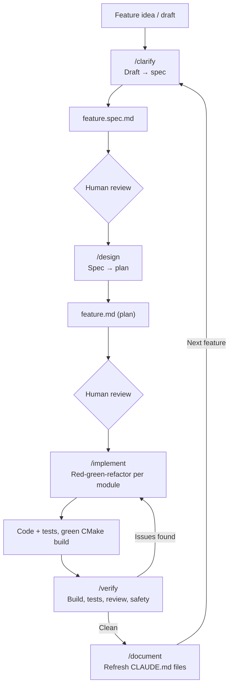

# Mobile Network Operator Simplified Billing Demo

## Task Description

Create code for simplified billing of a mobile network operator.

We use the following rules for calculating call cost:
* Fixed connection fee of 0.33 that is added to any call cost.
* Minute fee is charged at the beginning of each minute, so if call duration is 1:03 two minutes cost should be paid
* Each subscriber has 30 minutes of free talking inside his operator network, valid for 30 days since the date when last credit was added.
* After free minutes expire, calls inside home operator network are charged 0.50 per minute.
* When calling numbers outside of home network, minute cost is 0.95
* On weekends, first five minutes of every call are free.

We define home network of the operator as a set of phone numbers starting with one of the given prefixes (050, 066, 095 and 099)

Create code calculating call cost, given date and time for its start and end, number called and subscriber account information.

Make code readable and easy to configure, maintain and modify.

Prepare demo application that allows testing the code with some example data.

Do not use any platform specific libraries or implementation-specific language features. Include any supplementary code, such as unit tests. Provide build scripts used for compilation and detailed instructions how to use them.

## Workflow

Let me also render it so you can see it directly in this chat:Both versions show the same five-stage loop: `/clarify` → `/design` → `/implement` → `/verify` → `/document`, with a human review gate after the first two stages, a fix-loop back to `/implement` if `/verify` finds problems, and a final loop from `/document` back to `/clarify` for the next feature. The code block above is the portable Mermaid source — copy it as-is into any `.md` file that supports Mermaid rendering (GitHub, GitLab, Notion, etc.).

**1. `/clarify <draft-or-description>`**
Give it a rough idea — a few bullet points, a paste from a ticket, or nothing at all (it'll ask). It reads your `CLAUDE.md` files, asks clarifying questions about anything it can't infer (performance budgets, thread-safety, ABI constraints), then writes `docs/plans/<feature>.spec.md`. **Review this file by hand before moving on** — it's the contract for everything downstream.

**2. `/design docs/plans/<feature>.spec.md`**
Turns the spec into a concrete, file-level plan: which modules change, what the new function signatures and ownership semantics look like, and the order to implement things in (dependency order — leaf modules first). Ends with a self-review checklist and saves `docs/plans/<feature>.md`. **Review the plan before implementing** — this is the cheapest point to catch a bad design decision.

**3. `/implement docs/plans/<feature>.md`**
Writes the code, one module at a time, strictly red→green→refactor: tests first (must fail), then minimal code to pass, then cleanup. You can scope it to one module with `--module <name>` if the feature spans several and you want to review incrementally. It self-checks after each change (predict → run → compare) rather than blindly trusting green tests.

**4. `/verify docs/plans/<feature>.spec.md`**
Runs the full safety net: clean build with warnings-as-errors, full local test suite (`ctest`), dead-code scan, parallel review passes (memory-safety, exception-safety, type design, comments), spec-vs-implementation traceability, and a UB/safety checklist. Outputs a verdict — either "ready to commit" or a list of fixes, in which case you loop back to `/implement`.

**5. `/document`**
Once `/verify` is clean, this refreshes the `CLAUDE.md` files so they match the new code. This matters because every command above starts by reading those files — skip this step a few times and the whole pipeline starts working from stale context.

After `/document`, the feature is ready for your own final read-through and merge, and you start the next feature back at `/clarify`.

## AI Tools
* [Как я перестал вайбкодить и собрал работающий SDLC из пяти промптов](https://habr.com/ru/articles/1018872/) , <https://github.com/pserge-bender/claude-commands-sample/>
* [Как я заставил ИИ писать код по книжке: Clean Architecture + TDD на автопилоте](https://habr.com/ru/articles/1023998/) , <https://github.com/rakovi4/continue-example>
* [Ultralight Orchestration](https://gist.github.com/burkeholland/0e68481f96e94bbb98134fa6efd00436)